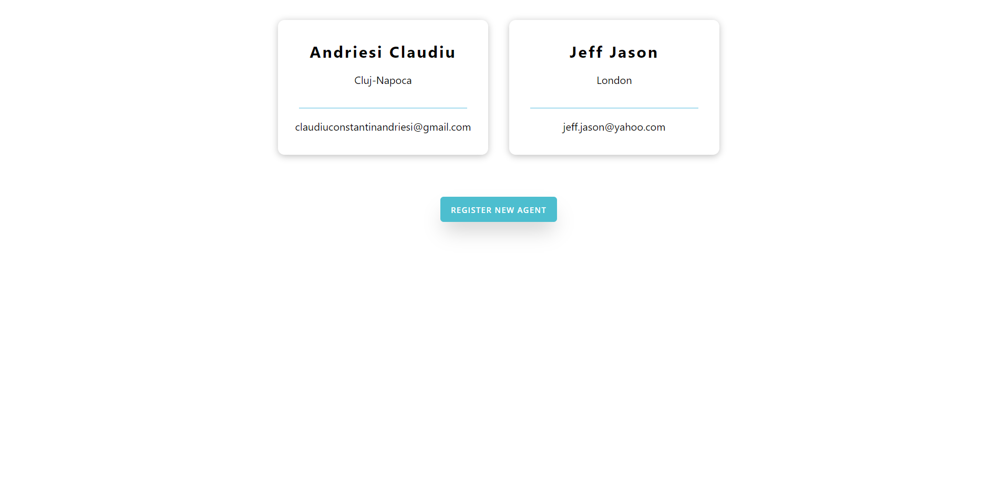

# Application Setup
### Environment file
Create a file called `.env` with the following properties:
```
REACT_APP_SERVICE_HOST=<serviceshost>
```

### Starting steps
```
npm install
npm start
```
# Preview
### Home page


### Agents page


### Forecast page


### Simulation page


